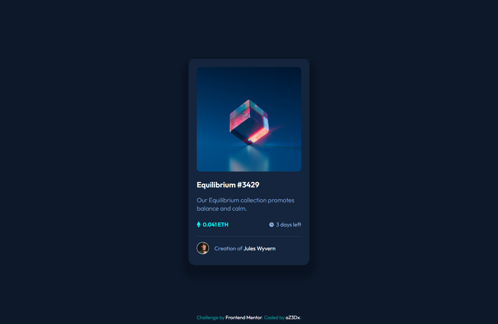
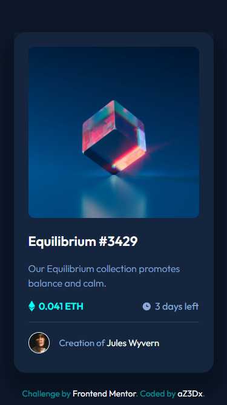

# Frontend Mentor - NFT preview card component solution

This is a solution to the [NFT preview card component challenge on Frontend Mentor](https://www.frontendmentor.io/challenges/nft-preview-card-component-SbdUL_w0U). Frontend Mentor challenges help you improve your coding skills by building realistic projects. 

## Table of contents

- [Overview](#overview)
  - [Screenshot](#screenshot)
  - [Links](#links)
- [My process](#my-process)
  - [Built with](#built-with)
- [Author](#author)
- [Acknowledgments](#acknowledgments)

## Overview

### The challenge

Users should be able to:

- View the optimal layout depending on their device's screen size
- See hover states for interactive elements

### Screenshot

Desktop

Mobile

### Links

- Solution URL: [Here 🐱‍👤](https://github.com/aZ3Dx/nft-preview-card-component-main)
- Live Site URL: [Here 📟](https://az3dx.github.io/nft-preview-card-component-main)

## My process

### Built with

- CSS custom properties
- Flexbox and CSS Grid
- Mobile-first workflow

## Author

- Frontend Mentor - [@aZ3Dx](https://www.frontendmentor.io/profile/aZ3Dx)
